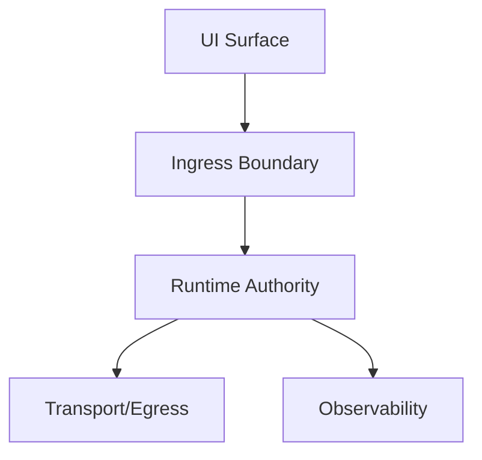

# DG-0001: Runtime Topology and Control-Plane Authority

## Metadata

- Guide ID: `DG-0001`
- Audience: `Developer`
- Status: `Active`
- Owners: `@jido-code-ui`
- Last Reviewed: `2026-03-08`
- Diagram Required: `yes`

## Purpose

Describe runtime topology, boundaries, and control-plane ownership for `jido_code_ui`.

## Scope

In scope:

- runtime surfaces and directional flow
- control-plane ownership and non-authoritative boundaries
- contract-first governance and conformance mapping

Out of scope:

- product feature specifics and business logic details

## Architecture Summary

`jido_code_ui` follows a contract-first model where topology, boundaries, and control-plane ownership are specified before implementation details. Governance traceability is enforced through `REQ/SCN/AC` mappings and CI gates.

## Diagram (Mermaid)

## Component Interactions

- Ingress validates payload shape before runtime dispatch.
- Runtime authority applies deterministic state transition rules.
- Transport remains non-authoritative and carries canonical envelopes.
- Observability emits correlated success/failure telemetry.

## Governance Mapping

### Spec Refs

- [topology.md](../../specs/topology.md)
- [control_planes.md](../../specs/control_planes.md)
- [boundaries.md](../../specs/boundaries.md)
- [control_plane_ownership_matrix.md](../../specs/contracts/control_plane_ownership_matrix.md)
- [spec_conformance_matrix.md](../../specs/conformance/spec_conformance_matrix.md)

### REQ Refs

- `REQ-GUIDE-*`
- `REQ-GTRACE-*`
- `REQ-CP-*`
- `REQ-SVC-*`
- `REQ-OBS-*`
- `REQ-DATA-*`

### Scenario Refs

- `SCN-001`
- `SCN-003`
- `SCN-004`
- `SCN-005`
- `SCN-008`
- `GSCN-001`
- `GSCN-006`
- `GSCN-007`
