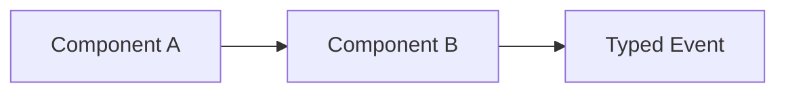

# DG-XXXX: <Title>

## Metadata

- Guide ID: `DG-XXXX`
- Audience: `Developer`
- Status: `Draft`
- Owners: `@team-or-handle`
- Last Reviewed: `YYYY-MM-DD`
- Diagram Required: `yes|no`

## Purpose

Describe the architecture concern this guide explains.

## Scope

In scope:

- ...

Out of scope:

- ...

## Architecture Summary

Explain boundaries, lifecycle, and contracts.

## Diagram (Mermaid)

## Component Interactions

- ...

## Governance Mapping

### Spec Refs

- [example spec](../../specs/design.md)

### REQ Refs

- `REQ-GUIDE-*`
- `REQ-GTRACE-*`

### Scenario Refs

- `GSCN-001`
