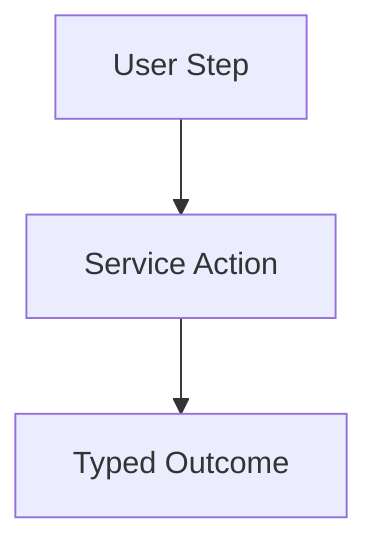

# UG-XXXX: <Title>

## Metadata

- Guide ID: `UG-XXXX`
- Audience: `User`
- Status: `Draft`
- Owners: `@team-or-handle`
- Last Reviewed: `YYYY-MM-DD`
- Diagram Required: `yes|no`

## Purpose

Describe the user problem this guide solves.

## Prerequisites

- ...

## Workflow

1. ...
2. ...

## Expected Outcomes

- ...

## Failure Cases

- Typed failure case and mitigation guidance.

## Diagram (Mermaid)

## Governance Mapping

### Spec Refs

- [example spec](../../specs/services/example.md)

### REQ Refs

- `REQ-GUIDE-*`
- `REQ-GTRACE-*`

### Scenario Refs

- `GSCN-001`
