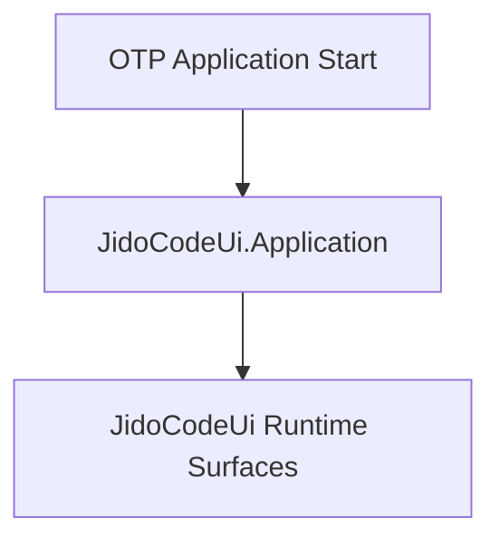

# Ui Application (`JidoCodeUi.Application`)

## Purpose

`JidoCodeUi.Application` is the runtime entry point for `jido_code_ui`. It establishes root startup boundaries and deterministic handoff to runtime services.

## Control Plane

Primary control-plane ownership: **UI Runtime Plane**.

## Dependency View

## Design Intent

- keep startup order deterministic and auditable
- keep runtime ownership and handoff boundaries explicit
- emit typed lifecycle outcomes for observability

### Acceptance Criteria

| Acceptance ID (AC-XX) | Criterion | Verification |
|---|---|---|
| `AC-01` | Application boot path is deterministic and reproducible. | Startup integration assertions over ordered lifecycle checkpoints. |
| `AC-02` | Startup failures return typed errors and retain correlation metadata. | Fault-injection tests asserting `TypedError` shape and IDs. |
| `AC-03` | Root startup ownership remains within declared control-plane boundaries. | Control-plane routing review and contract checks. |

## Governance Mapping

### Requirement Families

- `REQ-CP-*`
- `REQ-SVC-*`
- `REQ-OBS-*`

### Scenario Coverage

- `SCN-001`
- `SCN-003`
- `SCN-004`
- `SCN-005`

## Normative Contracts

- [control_plane_ownership_matrix.md](../contracts/control_plane_ownership_matrix.md)
- [service_contract.md](../contracts/service_contract.md)
- [observability_contract.md](../contracts/observability_contract.md)

## Control Plane ADR

- [ADR-0001-control-plane-authority.md](../adr/ADR-0001-control-plane-authority.md)
