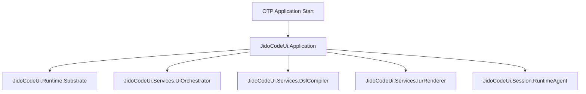

# Ui Application (`JidoCodeUi.Application`)

## Purpose

`JidoCodeUi.Application` is the runtime entry point for `jido_code_ui`. It establishes deterministic startup order for orchestration, compile, render, and session services that implement the `unified-ui DSL -> unified-iur -> web-ui` pipeline.

## Control Plane

Primary control-plane ownership: **UI Runtime Plane**.

## Dependency View

## Design Intent

- enforce deterministic startup and dependency wiring
- keep control-plane boundaries explicit at boot time
- ensure compile/render services are available before command intake opens

### Acceptance Criteria

| Acceptance ID (AC-XX) | Criterion | Verification |
|---|---|---|
| `AC-01` | Application boot order is deterministic across runs. | Startup integration tests assert ordered readiness checkpoints. |
| `AC-02` | Boot wiring includes orchestrator, compiler, renderer, and session runtime services. | Supervision-tree assertions for required child specs. |
| `AC-03` | Startup failures emit typed errors with correlation metadata. | Fault-injection tests on startup dependencies. |
| `AC-04` | Startup does not grant transport modules runtime-state mutation authority. | Control-plane boundary checks against ownership matrix. |

## Governance Mapping

### Requirement Families

- `REQ-CP-*`
- `REQ-SVC-*`
- `REQ-OBS-*`

### Scenario Coverage

- `SCN-001`
- `SCN-003`
- `SCN-004`
- `SCN-005`

## Normative Contracts

- [control_plane_ownership_matrix.md](../contracts/control_plane_ownership_matrix.md)
- [service_contract.md](../contracts/service_contract.md)
- [observability_contract.md](../contracts/observability_contract.md)

## Control Plane ADR

- [ADR-0001-control-plane-authority.md](../adr/ADR-0001-control-plane-authority.md)
