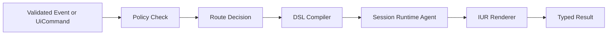

# Ui Orchestrator Service (`JidoCodeUi.Services.UiOrchestrator`)

## Purpose

Performs deterministic handoff from validated commands/events to policy, compile, session, and render handlers while preserving typed outcomes.

## Control Plane

Primary control-plane ownership: **Runtime Authority Plane**.

## Workflow Diagram

### Acceptance Criteria

| Acceptance ID (AC-XX) | Criterion | Verification |
|---|---|---|
| `AC-01` | Orchestrator routes equivalent inputs to the same execution path. | Deterministic routing tests for repeated inputs. |
| `AC-02` | Server-authoritative DSL compile is invoked only after policy and validation checks pass. | Ordered workflow tests with denied and allowed paths. |
| `AC-03` | Authorization failures fail closed and include typed, auditable error metadata. | Security-path tests over deny outcomes. |
| `AC-04` | Successful compile/render flows emit required observability events. | Telemetry assertions against required event families. |
| `AC-05` | IUR output metadata (version/hash/compile authority) is preserved through session and response payloads. | Contract tests across compile -> session -> render handoff. |
| `AC-06` | Custom DSL node execution is allowed only when feature-flag policy allows it. | Policy toggle tests over allow and deny paths. |

## Governance Mapping

### Requirement Families

- `REQ-SVC-*`
- `REQ-SEC-*`
- `REQ-OBS-*`
- `REQ-DATA-*`

### Scenario Coverage

- `SCN-002`
- `SCN-003`
- `SCN-004`
- `SCN-005`
- `SCN-006`
- `SCN-007`
- `SCN-008`

## Normative Contracts

- [service_contract.md](../contracts/service_contract.md)
- [security_contract.md](../contracts/security_contract.md)
- [observability_contract.md](../contracts/observability_contract.md)
- [data_contract.md](../contracts/data_contract.md)
- [control_plane_ownership_matrix.md](../contracts/control_plane_ownership_matrix.md)

## Control Plane ADR

- [ADR-0001-control-plane-authority.md](../adr/ADR-0001-control-plane-authority.md)
