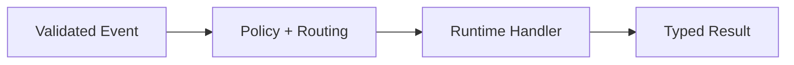

# Ui Orchestrator Service (`JidoCodeUi.Services.Orchestrator`)

## Purpose

Performs deterministic handoff from validated ingress events to the correct runtime handlers while preserving typed outcomes.

## Control Plane

Primary control-plane ownership: **Runtime Authority Plane**.

## Workflow Diagram

### Acceptance Criteria

| Acceptance ID (AC-XX) | Criterion | Verification |
|---|---|---|
| `AC-01` | Service validates operation inputs and routes deterministically. | Deterministic routing tests for identical inputs. |
| `AC-02` | Unauthorized requests fail closed with auditable typed errors. | Authorization-path tests over deny outcomes. |
| `AC-03` | Service emits required observability events for success/failure. | Telemetry assertions against required event families. |

## Governance Mapping

### Requirement Families

- `REQ-SVC-*`
- `REQ-SEC-*`
- `REQ-OBS-*`

### Scenario Coverage

- `SCN-002`
- `SCN-004`
- `SCN-005`
- `SCN-006`
- `SCN-007`

## Normative Contracts

- [service_contract.md](../contracts/service_contract.md)
- [security_contract.md](../contracts/security_contract.md)
- [observability_contract.md](../contracts/observability_contract.md)
- [control_plane_ownership_matrix.md](../contracts/control_plane_ownership_matrix.md)

## Control Plane ADR

- [ADR-0001-control-plane-authority.md](../adr/ADR-0001-control-plane-authority.md)
