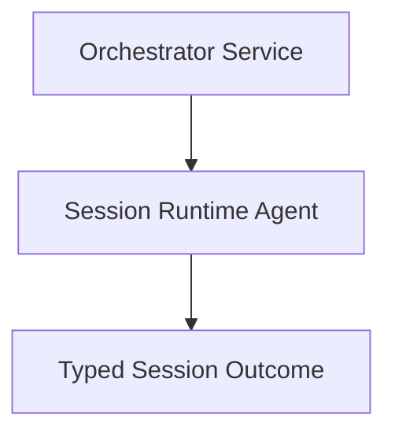

# Ui Session Runtime Agent (`JidoCodeUi.Session.RuntimeAgent`)

## Purpose

Owns deterministic session-level state transitions and typed outcome emission for runtime interactions.

## Control Plane

Primary control-plane ownership: **Runtime Authority Plane**.

## Dependency View

### Acceptance Criteria

| Acceptance ID (AC-XX) | Criterion | Verification |
|---|---|---|
| `AC-01` | Session transitions follow deterministic state semantics. | Transition-table tests for valid/invalid state moves. |
| `AC-02` | Session failures emit typed errors with correlation continuity. | Error-path tests asserting typed error and IDs. |
| `AC-03` | Session state ownership is not bypassed by transport/infrastructure layers. | Boundary tests across control-plane seams. |

## Governance Mapping

### Requirement Families

- `REQ-CP-*`
- `REQ-SVC-*`
- `REQ-DATA-*`

### Scenario Coverage

- `SCN-001`
- `SCN-003`
- `SCN-004`
- `SCN-008`

## Normative Contracts

- [control_plane_ownership_matrix.md](../contracts/control_plane_ownership_matrix.md)
- [service_contract.md](../contracts/service_contract.md)
- [data_contract.md](../contracts/data_contract.md)

## Control Plane ADR

- [ADR-0001-control-plane-authority.md](../adr/ADR-0001-control-plane-authority.md)
