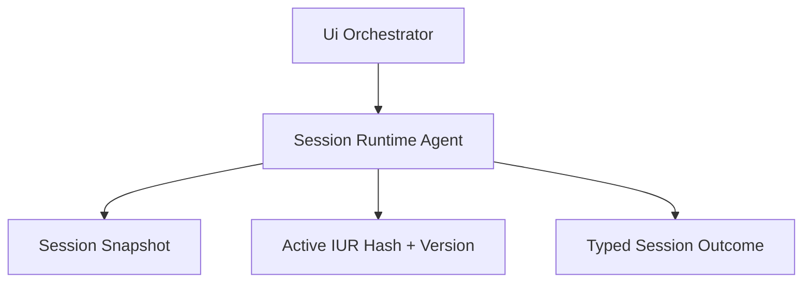

# Ui Session Runtime Agent (`JidoCodeUi.Session.RuntimeAgent`)

## Purpose

Owns deterministic session-level state transitions for DSL snapshots, IUR compile artifacts, and typed runtime outcomes.

## Control Plane

Primary control-plane ownership: **Runtime Authority Plane**.

## Dependency View

### Acceptance Criteria

| Acceptance ID (AC-XX) | Criterion | Verification |
|---|---|---|
| `AC-01` | Session transitions preserve deterministic in-memory state semantics for DSL and IUR artifacts. | Transition-table tests for valid/invalid state moves. |
| `AC-02` | Failed compile/render attempts retain last known-good session projection unless explicit rollback policy applies. | Failure-path state retention tests. |
| `AC-03` | Session failures emit typed errors with correlation continuity. | Error-path tests asserting typed error and continuity IDs. |
| `AC-04` | Replay of recorded command/event stream reproduces session IUR hash parity from in-memory snapshots. | Replay conformance tests with deterministic hash checks. |
| `AC-05` | Session runtime does not require external persistence in v1. | Runtime tests that execute complete flows without persistence adapters. |

## Governance Mapping

### Requirement Families

- `REQ-CP-*`
- `REQ-SVC-*`
- `REQ-DATA-*`

### Scenario Coverage

- `SCN-001`
- `SCN-003`
- `SCN-004`
- `SCN-008`

## Normative Contracts

- [control_plane_ownership_matrix.md](../contracts/control_plane_ownership_matrix.md)
- [service_contract.md](../contracts/service_contract.md)
- [data_contract.md](../contracts/data_contract.md)

## Control Plane ADR

- [ADR-0001-control-plane-authority.md](../adr/ADR-0001-control-plane-authority.md)
