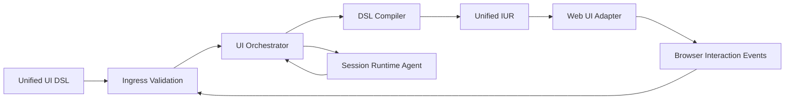

# Topology

## Runtime Surfaces

| Surface | Responsibility | Notes |
|---|---|---|
| `DSL Authoring Surface` | Produce `unified-ui` DSL documents from feature intent. | Includes server-provided and generated UI specs. |
| `Ingress/Transport Surface` | Validate envelopes, auth context, and correlation metadata. | No session mutation authority. |
| `Orchestration Surface` | Route commands/events to compile, session, and render flows. | Applies policy and emits typed outcomes. |
| `Transform Surface` | Compile DSL into canonical `unified-iur` representation. | Deterministic, version-aware, and server-authoritative. |
| `Render Surface` | Adapt `unified-iur` into `web-ui` render responses. | Emits widget events for next cycle. |
| `Session Surface` | Own session-level UI state transitions and replayability. | Runtime authority for state changes. |

## Data/Control Flow

Directionality rules:

- Transport forwards validated envelopes to orchestration only.
- Client/browser surfaces MUST NOT act as authoritative DSL->IUR compilers.
- Compile/render services do not bypass orchestration for mutating operations.
- Session state transitions are authoritative only in the session surface.
